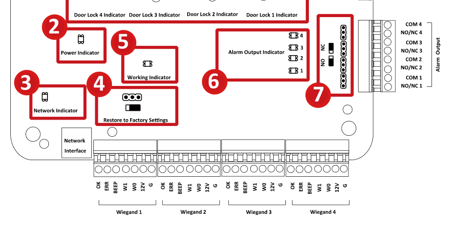

# Standard Wiring For ACS

#### Please read the instruction below.

Basically, this wiring can be used for multiple devices.
Cause the differences is not much, however, u can also use this wiring with your own device. it should be work as long as the circuit board similarly looks like this.

### **This sample board below I took from Hikvision so it much easier for you to read.**

I've made it simple as I can and more readable for it.

About this wiring :

* Using two M-Lock (any type u can use this wiring as long as the board are similiar)
* Using two Push Button
* Jumper from door 1 to door 2
* Using two adapter
